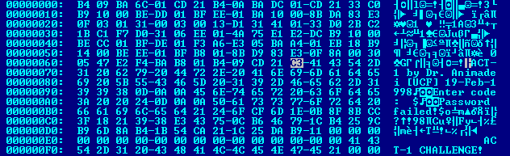
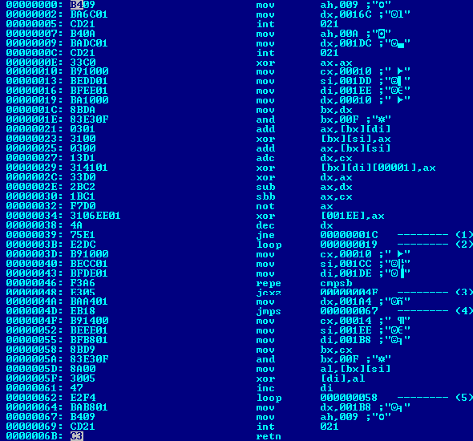

# Анализ и редактирование COM-программ с помощью редактора HIEW

## Анализ программы ACT-1.COM

Текст программы в hex-режиме:



Видим, что адресу `6B` соответствует граница между нечитаемым и осмысленным текстом, из чего можем предположить, что этот адрес соответствует окончанию блока кода и началу блока хранимых данных:

И действительно, в decode-режиме видим, что адресу `6B` соответствует инструкция `retn`, завершающая программу.

Таким образом, в decode-режиме блок кода выглядит так:



### Анализ инструкций блока кода

```assembly
00: mov ah,009
02: mov dx,0016C
05: int 021
```

отвечают за запись в стандартный поток вывода строки:

```commandline
ACT-1 by Dr. Animadei [UCF] 19-Feb-1998
Enter code: 
```

Инструкция `int 021` генерирует прерывание `21h`, отвечающее за вызов одной из команд MS-DOS.
Номер этой команды берётся из регистра `ah`.
Команда `09h` помещает в поток стандартного вывода строку, завершающуюся символом `$`.
Адрес этой строки берётся из регистра `dx`.
По адресу `6C` (и до символа `$`) и находится приведённая выше строка

---

```assembly
07: mov ah,00A
09: mov dx,001DC
0C: int 021
```

отвечают за считывание первых 16 байт из стандартного потока ввода.

Команда `0Ah` считывает из потока стандартного ввода строку и записывает её в буфер.
Адрес этого буфера берётся из регистра `dx`, а его длина (в байтах) соответствует первому значению по этому адресу.
По адресу `DC` находится буфер, длина которого равна 17 байт (или 11 в 16-ричной системе).
Один из этих байт зарезервирован системой, поэтому для записи доступно 16 байт

---

```assembly
0E: xor ax.ax
10: mov cx,00010
13: mov si,001DD
16: mov di,001EE
19: mov dx,00010
1C: mov bx,dx
1E: and bx,00F
21: add ax,[bx][di]
23: xor [bx][si],ax
25: add ax,[bx][si]
27: adc dx,cx
29: xor [bx][di][00001],ax
2C: xor dx,ax
2E: sub ax,dx
30: sbb ax,cx
32: not ax
34: xor [001EE],ax
38: dec dx
39: jne 00000001C
3B: loop 000000019
```

отвечают за генерацию пароля для расшифровки путём "смешивания" со строкой `ACT-1 CHALLENGE!`, расположенной по адресу `EE`.

Инструкция `13: ...` заносит в регистр `si` указатель на буфер, в который заносилось считанное с клавиатуры значение.
Инструкция `16: ...` заносит в регистр `di` указатель на строку `ACT-1 CHALLENGE!`.
Далее происходит смешивание этих строк с сохранением результата по их же адресам, до тех пор пока значение в регистре `cx` не станет нулевым (так работает инструкция `loop`)

---

```assembly
3D: mov cx,00010
40: mov si,001CC
43: mov di,001DE
46: repe cmpsb
48: jcxz 00000004F
4A: mov dx,001A4
4D: jmps 000000067
```

отвечают за проверку правильности введённого пароля.

В регистр `si` заносится адрес хранящейся в памяти строки символов (инструкция `40: ...`), в регистр `di` — адрес 1-й части результата смешивания (инструкция `43: ...`).
Эти строки сравниваются с помощью инструкции `repe cmpsb`.
Если эти строки равны, срабатывает переход по адресу `4F`; если нет — выводится строка `Password failed!` (по адресу `A4`) и программа завершает работу

---

```assembly
4F: mov cx,00014
52: mov si,001EE
55: mov di,001B8
58: mov bx,cx
5A: and bx,00F
5D: mov al,[bx][si]
5F: xor [di],al
61: inc di
62: loop 000000058
64: mov dx,001B8
67: mov ah,009
69: int 021
```

отвечают за вывод расшифрованного сообщения.

В регистр `si` заносится адрес 2-й части результата смешивания, в регистр `di` — адрес зашифрованного сообщения.
Далее происходит расшифровка сообщения (инструкции `58: ...`–`62: ...`) и его вывод в консоль.
