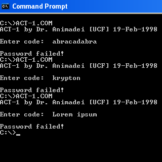

# Анализ и редактирование COM-программ

> :octopus: [Radare2: Libre Reversing Framework for Unix Geeks](https://github.com/radareorg/radare2)

> COM-программы выполнялись в Windows XP

## Анализ программы ACT-1.COM



Для удобства анализа выгрузим hex-представление и ассембли программы в соответствующие файлы:

```bash
$ cd ACT-1/
$ r2 -b 16 ACT-1.COM  # открыть программу в режиме чтения, с указанием размера регистра - 16 бит
> px > ACT-1.COM_hex  # сохранить hex-представление программы
> /a ret ~[0]         # найти адрес инструкции ret (которая завершает программу)
0x0000006b
> pD 0x6c > ACT-1.COM_assembly  # дизассемблировать код программы (до инструкции ret включительно) и сохранить результат
> q  # выйти из интерактивной оболочки radare2
```

### Анализ инструкций

```assembly
00: mov ah, 9
02: mov dx, 0x16c
05: int 0x21
```

отвечают за запись в стандартный поток вывода строки:

```commandline
ACT-1 by Dr. Animadei [UCF] 19-Feb-1998
Enter code: 
```

Инструкция `int 0x21` генерирует прерывание `0x21`, отвечающее за вызов одной из команд MS-DOS.
Номер этой команды берётся из регистра `ah`.
Команда `9` помещает в поток стандартного вывода строку, завершающуюся символом `$`.
Адрес этой строки берётся из регистра `dx`.
По адресу `6C` (и до символа `$`) и находится приведённая выше строка

---

```assembly
07: mov ah, 0xa
09: mov dx, 0x1dc
0c: int 0x21
```

отвечают за считывание первых 16 байт из стандартного потока ввода.

Команда `0xa` считывает из потока стандартного ввода строку и записывает её в буфер.
Адрес этого буфера берётся из регистра `dx`, а его длина (в байтах) соответствует первому значению по этому адресу.
По адресу `dc` находится значение длины буфера — 17, — следующие 17 байт и являются буфером.
Один из этих байт зарезервирован системой, поэтому для записи доступно 16 байт

---

```assembly
0e: xor ax, ax
10: mov cx, 0x10
13: mov si, 0x1dd
16: mov di, 0x1ee
19: mov dx, 0x10
1c: mov bx, dx
1e: and bx, 0xf
21: add ax, word [bx + di]
23: xor word [bx + si], ax
25: add ax, word [bx + si]
27: adc dx, cx
29: xor word [bx + di + 1], ax
2c: xor dx, ax
2e: sub ax, dx
30: sbb ax, cx
32: not ax
34: xor word [0x1ee], ax
38: dec dx
39: jne 0x1c
3b: loop 0x19
```

отвечают за генерацию пароля для расшифровки путём "смешивания" со строкой `ACT-1 CHALLENGE!`, расположенной по адресу `ee`.

Инструкция `13: ...` заносит в регистр `si` указатель на буфер, в который заносилось считанное с клавиатуры значение.
Инструкция `16: ...` заносит в регистр `di` указатель на строку `ACT-1 CHALLENGE!`.
Далее происходит смешивание этих строк с сохранением результата по их же адресам, до тех пор пока значение в регистре `cx` не станет нулевым (так работает инструкция `loop`)

---

```assembly
3d: mov cx, 0x10
40: mov si, 0x1cc
43: mov di, 0x1de
46: repe cmpsb byte [si], byte es:[di]
48: jcxz 0x4f
4a: mov dx, 0x1a4
4d: jmps 0x67
```

отвечают за проверку правильности введённого пароля.

В регистр `si` заносится адрес хранящейся в памяти строки символов (инструкция `40: ...`), в регистр `di` — адрес 1-й части результата смешивания (инструкция `43: ...`).
Эти строки сравниваются с помощью инструкции `repe cmpsb`.
Если эти строки равны, срабатывает переход по адресу `4f`; если нет — выводится строка `Password failed!` (по адресу `a4`), и программа завершает работу

---

```assembly
4f: mov cx, 0x14
52: mov si, 0x1ee
55: mov di, 0x1b8
58: mov bx, cx
5a: and bx, 0xf
5d: mov al, byte [bx + si]
5f: xor byte [di], al
61: inc di
62: loop 0x58
64: mov dx,0x1b8
67: mov ah, 9
69: int 0x21
```

отвечают за вывод расшифрованного сообщения.

В регистр `si` заносится адрес 2-й части результата смешивания, в регистр `di` — адрес зашифрованного сообщения.
Далее происходит расшифровка сообщения (инструкции `58: ...`–`62: ...`) и его вывод в консоль.


## Анализ программы CRACKME.COM


Выгрузим hex-представление и ассембли программы в соответствующие файлы:

```bash
$ cd CRACKME/
$ r2 -b 16 CRACKME.COM  # открыть программу в режиме чтения, с указанием размера регистра - 16 бит
> px > CRACKME.COM_hex  # сохранить hex-представление программы
> /a ret ~[0]           # найти адреса инструкций ret
0x00000035
0x0000003a
> pD 0x3b > CRACKME.COM_assembly  # дизассемблировать код программы (до последней инструкции ret включительно) и сохранить результат
> q  # выйти из интерактивной оболочки radare2
```

### Анализ инструкций

```assembly
00: mov dx, 0x13b
03: call 0x36
36: mov ah, 9
38: int 0x21
3a: ret
```

отвечают за запись в стандартный поток вывода строки `Type yer attempt: `.

```assembly
06: mov dx, 0x160
09: mov ax, 0xa00
0c: int 0x21
```

отвечают за считывание 1 байта из стандартного потока ввода (значение по адресу `60` — 2, — является размером буфера)

---

```assembly
0e: mov dx, 0x14e
11: mov eax, 0x5354454e
17: movzx ecx, byte [0x162]
1d: rol eax, 6
21: xor ah, al
23: add al, cl
25: loop 0x1d
```

```assembly
27: cmp eax, 0xd62722e8
2d: je 0x32
2f: mov dx, 0x157
32: call 0x36
36: mov ah, 9
38: int 0x21
3a: ret
```

Оба блока инструкций в совокупности отвечают за проверку соответствия введённого символа некоторому значению.
В случае соответствия в терминал выводится строка `\nRight!`, иначе — `\nWrong!`.

Первый блок отвечает за изменение по определённому алгоритму значения в регистре `eax`, причём это значение зависит от введённого символа.

Второй блок отвечает за проверку значения в регистре `eax` с эталонным значением: если они равны, то значение в регистре `dx` определяется командой `0e`, и соответственно выводится строка `\nRight!`; иначе значение в регистре `dx` перезаписывается так, что выводится строка `\nWrong!`.

### Взлом программы

Таким образом, чтобы при любом введённом символе выводилась строка `\nRight!`, достаточно заменить инструкцию `2f: mov dx, 0x157` на `nop`'ы:

```bash
$ cp CRACKME.COM CRACKME.COM_copy
$ r2 -b 16 -w CRACKME.COM_copy  # открыть программу в режиме записи
> s 0x2f                        # перейти по адресу 0x2f
> wa nop @@=$$ $$+1 $$+1        # записать nop'ы в 3-х байта, которые занимала инструкция `mov dx, 0x157`
> pD 0x3b @ 0 > CRACKED.COM_assembly  # сохранить ассембли взломанной программы
> q
$ mv CRACKME.COM_copy CRACKED.COM
```

Результат выполнения взломанной программы:


