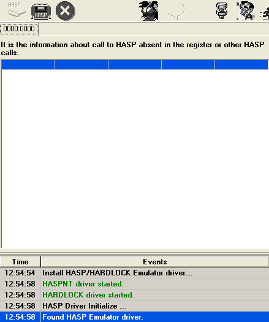

# HASP

## Установка эмулятора электронного ключа

1. установить утилиту, которая устанавливает драйвера электронного ключа HASP:
   1. запустить `hinstall_I.bat`
   2. перезагрузить ПК
   3. запустить `hinstall_R.bat`
2. установить эмулятор электронного ключа HASP, запустив `haspemul.exe`
3. установить драйвера для эмулятора, запустив его и нажав "Install HASP Emulator Driver"

Результирующий вид программы HASP Emul:



## Получение информации об электронном ключе

1. открыть в среде Dev-C++ проект `HASP.dev`
2. запустить программу `main.cpp`

### Результат

```commandline
HASP is here
Available memory size is 0
HASP type is 0
LPT port is 102
API version is 7500
```

Тип HASP `0` означает HASP4 без памяти
