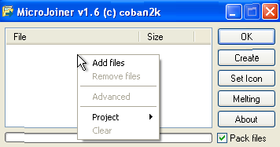
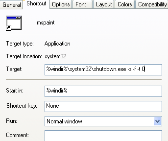
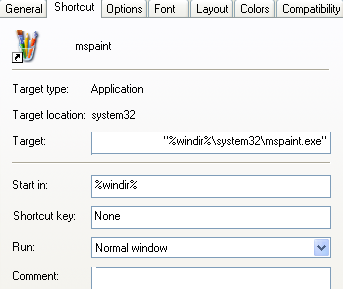
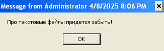

# Способы внедрения вредоносного ПО в Windows XP

## Изменение сведений об исполняемом файле

Дан исполняемый файл `notepad.exe`.
Если в проводнике навести на него указатель, появляется контекстная подсказка со следующими сведениями:

```text
Description: Notepad
Company: Microsoft Corporation
File Version: 5.1.2600.5512
...
```

Нетрудно догадаться, что эти сведения берутся из самого файла.
И действительно, в тексте программы находим соответствующее содержание:

```text
...
CompanyName  Microsoft Corporation 8  FileDescription  Notepad b! FileVersion  5.1.2600.5512
...
```

Теперь приступим к изменению этих сведений.

> Изменение количества байт программы относительно исходного может нарушить соответствие между адресами и ожидаемыми значениями по этим адресам, и программа будет работать некорректно.
Поэтому, чтобы гарантированно не нарушилась логика работы программы, размеры исходных и заменённых сведений должны быть одинаковыми.

Изменим, например, значение параметра `FileDescription`.
Длина исходного значения, — `Notepad`, — 7 символов.
В файле используется кодировка UTF-16, значит каждому символу соответствует 2 байта.
С учётом этого в качестве нового значения можем взять, например, `Yoptпад`, которое также соответствует 14 байтам в UTF-16.

Остаётся убедиться, что сведения в контекстной подсказке проводника изменились соответственно:

```text
Description: Yoptпад
...
```

## Внедрение вредоносных программ с помощью склейки с другими файлами

Этот способ основан на том, что запуск склеенной программы инициирует запуск всех программ склейки.

> Для склейки файлов будем использовать программу **MicroJoiner**

### Пример 1. Маскировка вредоносной программы иконкой и именем другой программы

Пусть мы хотим пошутить над нашим знакомым, замаскировав программу-шутку `sheep.exe` под видом полезной программы.
Зная, например, что он пишет код во встроенном в систему приложении-блокноте, замаскируем программу-шутку под видом программы [Notepad++](https://notepad-plus-plus.org/downloads/v7.8.8), — более удобного для написания кода текстового редактора, — и отправим ему исполняемый файл якобы установщика этого редактора.

#### Последовательность действий в интерфейсе MicroJoiner'а

1. Вызвать контекстное меню в области, предназначенной для отображения файлов для склейки (например, нажав правую кнопку мыши) и затем выбрать `Add files`


2. В открывшемся диалоговом окне выбрать нужные файлы, — в нашем случае программу `sheep.exe`
3. Нажать `Set Icon` и в открывшемся диалоговом окне выбрать камуфлирующую программу или её иконку, — в нашем случае `npp_installer.exe`; иконка этой программы будет использована для маскировки вредоносной программы
4. Правой кнопкой мыши нажать `Create` и в открывшемся диалоговом окне выбрать расположение и имя результирующей программы, — в качестве имени выберем, например, близкое к имени камуфлирующей программы: `npp_installer_1.exe`;

### Пример 2. Склейка вредоносной программы с невредоносной

А как насчёт того, чтобы программа-шутка запускалась не вместо камуфлирующей программы, как в предыдущем примере, а вместе с ней?

Для этого достаточно добавить в склейку обе программы: шутку `sheep` и оригинальную `npp_installer`.

Результирующий файл назовём по аналогии с предыдущим примером, — `npp_installer_2.exe`

### Пример 3. Склейка нескольких вредоносных программ с невредоносной программой

Добавим в склейку из предыдущего примера ещё одну программу в качестве вредоносной, например, `HookDump`, которая предназначена для отслеживания действий пользователя.
Результирующий файл назовём `npp_installer_3.exe`

### Сводные таблицы размеров исходных и склеенных программ

Размеры исходных программ:

| программа | `sheep` | `hookdump` | `npp_installer` |
| --- | --- | --- | --- |
| размер, KB | 309 | 476 | 3686 |

Размеры склеенных программ:

| склейка | размер, KB |
| --- | --- |
| `sheep` with `npp` icon | 249 |
| (`sheep` + `npp_installer`) with `npp` icon | 4608 |
| (`sheep` + `hookdump` + `npp_installer`) with `npp` icon | 4782 |

### Реакция антивирусов на склеенные программы

Антивирус Kaspersky интерпретирует склеенную программу как троянское приложение `Trojan-Dropper.Win32.Microjoin.ah` и удаляет* его.

\* чтобы антивирус не удалял склеенные программы, в папку этого проекта были добавлены содержащие их архивы

## Скрытое внедрение ссылки на вредоносную программу в ярлык

Пусть мы хотим создать ярлык, при запуске которого компьютер немедленно завершает работу, закамуфлировав его под видом ярлыка на программу `mspaint`.

### Решение

1. В папке назначения вызвать контекстное меню проводника (например, нажав правую кнопку мыши) и выбрать **New | Shortcut**. Откроется диалоговое окно для создания ярлыка 
2. В поле **Type the location of the item:** ввести команду на завершение работы компьютера:

    ```text
    shutdown -s -f -t 0
    ```
    где:
    - `-s` — выключить компьютер (без перезагрузки)
    - `-f` — принудительно закрыть запущенные приложения без предупреждения
    - `-t 0` — установить тайм-аут для выключения в 0, т.е. выключить немедленно.

    Нажать **Next**

3. **Type a name of this shortcut:**

   ```text
   mspaint
   ```

   Нажать **Finish**.

На данном этапе окно свойств созданного ярлыка по умолчанию выглядит примерно так:



Как лучше скрыть реальное назначение ярлыка?

1. Установим для него оригинальную иконку программы `mspaint.exe`.
   Соответствующая последовательность действий:

   - Нажать **Change Icon**
   - В открывшемся диалоговом окне нажать **Browse**
   - В открывшемся затем диалоговом окне задать параметры:
     - Look in: `system32`
     - Files of type: `Programs`
     - File name: `mspaint.exe`

   и нажать **Open**

   - Нажать **OK**

2. Сделаем так, чтобы реальная команда не отображалась по умолчанию при открытии окна свойств ярлыка.

    Для реализации этого учтём:
    1. Для команды `shutdown` можно добавить комментарий
    2. Если содержимое поля **Target** имеет длину, большую длины самого поля, по умолчанию отображается часть содержимого с конца
    3. Поле **Target** в интерфейсе Windows XP имеет фиксированную длину (соответствует ~78 пробелам) 

    Собственно, последовательность действий:
    1. Добавить расположение программы `mspaint` в качестве комментария к команде `shutdown`, расположив его (комментарий) в самом конце списка аргументов.
    Соответственно, содержимое поля **Target** станет следующим:
       ```text
       %windir%\system32\shutdown.exe -s -f -t 0 -c "%windir%\system32\mspaint.exe"
       ```
    2. Добавить между аргументом `-c` и соответствующей строкой комментария столько пробелов, чтобы реальная команда по умолчанию не была видна в поле **Target**

В результате окно свойств созданного ярлыка теперь по умолчанию выглядит так:



## Внедрение вредоносной программы в качестве приложения по умолчанию для определённого типа файлов

Установить соответствие между типом файлов и приложением по умолчанию, открывающим этот тип файлов, существует команда `ftype`.

Например, команда

```commandline
> ftype txtfile
```

отображает текущую командную строку для типа файла `txtfile`.
По умолчанию будет выведено:

```text
txtfile=notepad %1
```

Чтобы при запуске текстовых файлов пользователь, например, получал сообщение _"Про текстовые файлы придётся забыть!"_, выполним следующую команду:

```commandline
> ftype txtfile=msg * "Про текстовые файлы придётся забыть"
```

Теперь при попытке открыть любой текстовый файл пользователь вместо интерфейса блокнота увидит следующее:



## Внедрение вредоносной программы в автозапуск

Запускаемые программы в Windows могут храниться в одном или нескольких из следующих ключей реестра:

- `HKLM\Software\Microsoft\Windows\CurrentVersion\RunOnce`
- `HKLM\Software\Microsoft\Windows\CurrentVersion\policies\Explorer\Run`
- `HKLM\Software\Microsoft\Windows\CurrentVersion\Run`
- `HKCU\Software\Microsoft\Windows NT\CurrentVersion\Windows` (значение `load`)
- `HKCU\Software\Microsoft\Windows\CurrentVersion\Run`
- `HKCU\Software\Microsoft\Windows\CurrentVersion\RunOnce`

Значения по ключам, начинающимся с `HKLM`, применяются ко всем пользователям компьютера, а начинающимся с `HKCU`, — только к текущему пользователю.

Значения по ключам, заканчивающимся на `RunOnce`, выполняются однажды при следующем запуске системы и затем удаляются; значения по остальным ключам не удаляются автоматически.

### Задание

Поочерёдно для каждого из представленных ключей реестра (т.е. так, чтобы значение оказывалось только в одном из ключей) добавим путь к вредоносной программе и проанализируем поведение системы при запуске.
В качестве вредоносной будем рассматривать программу **Paint** (`C:\\WINDOWS\system32\mspaint.exe`)

> Для запуска редактора реестра Windows:
> 1. Нажмите `Win + R` (откроется окно "Выполнить")
> 2. Введите `regedit` и нажмите `Enter`

### Как добавить значение по ключу в Regedit

1. Разверните ветку, пока не найдёте нужный ключ. Если его нет – создайте
2. Правый клик → New → выберите тип значения (в нашем случае StringValue)
3. Назовите его (например, _Paint_)
4. Дважды кликните по записи значения → введите содержимое значения (например, `C:\\WINDOWS\system32\mspaint.exe`)

### Анализ поведения системы

- `HKLM\Software\Microsoft\Windows\CurrentVersion\RunOnce`
   
   При _следующем_ запуске системы запускается Paint, причём до запуска среды рабочего стола (DE);
   DE запускается только после завершения работы Paint

- `HKCU\Software\Microsoft\Windows\CurrentVersion\RunOnce`

   Paint запускается вместе с системой (только при следующем запуске)

- `...\Run`

   Paint запускается вместе с системой

- `HKCU\Software\Microsoft\Windows NT\CurrentVersion\Windows` (значение `load`)

   Paint запускается вместе с системой в свёрнутом виде

## Внедрение вредоносных макросов в Word

### Как добавить макрос, который будет применяться ко всем документам Word

Для этого можно записать макрос в глобальный шаблон **Normal.dot**.
Вот как это сделать:

1. Перейдите в **Сервис | Макрос | Редактор Visual Basic** (`Alt + F11`)

2. В окне проекта (Project Explorer) найдите объект **Normal | Microsoft Word Objects | ThisDocument** и откройте его

3. Вставьте код макроса

4. Нажмите `Ctrl + S`, чтобы сохранить макрос

### Пример 1. Блокировка доступа к функционалу макросов и редактору VBA в Word

Для этого запишем в глобальный шаблон Normal.dot макрос с кодом, например, представленным в файле [`word_macro_virus_1.bas`](src/malware/word_macro_virus_1.bas)

> Один из способов исправить данную блокировку – удалить файл глобального шаблона Normal.dot.
> Абсолютный путь этого файла в общем* случае:\
> `C:\Documents and Settings\<User>\Application Data\Microsoft\Templates`

\* фактическое имя папки `Templates` зависит от языка интерфейса Word

### Пример 2. Внедрение полиморфного макровируса в Word

Исходный код примера полиморфного макровируса представлен в файле [`word_macro_virus_2.bas`](src/malware/word_macro_virus_2.bas);
соответствующий ему расшифрованный код – в файле [`word_macro_virus_2_decrypted.bas`](src/malware/word_macro_virus_2_decrypted.bas).

> Представленный макровирус не выполняет вредоносные функции, а только записывает свой код в шаблоны Normal.dot и шаблон текущего документа
