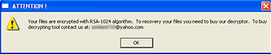

# Спецификация вируса `Win32.Gpcode.ak`

- формат: PE exe
- размер: 8030 байт
- платформа: Win32
- принцип работы: шифрует файлы пользователя на заражённом компьютере

После запуска:

1. Создаёт в памяти компьютера уникальный идентификатор (mutex) `_G_P_C_` для идентификации своего присутствия в системе.

2. Ищет на всех логических дисках файлы с расширениями:

    `7z`, `abk`, `abd`, `acad`, `arh`, `arj`, `ace`, `arx`, `asm`, `bz`,\
    `bz2`, `bak`, `bcb`, `c`, `cc`, `cdb`, `cdw`, `cdr`, `cer`, `cgi`,\
    `chm`, `cnt`, `cpp`, `css`, `csv`, `db`, `db1`, `db2`, `db3`, `db4`,\
    `dba`, `dbb`, `dbc`, `dbd`, `dbe`, `dbf`, `dbt`, `dbm`, `dbo`, `dbq`,\
    `dbx`, `djvu`, `doc`, `dok`, `dpr`, `dwg`, `dxf`, `ebd`, `eml`, `eni`,\
    `ert`, `fax`, `flb`, `frm`, `frt`, `frx`, `frg`, `gtd`, `gz`, `gzip`,\
    `gfa`, `gfr`, `gfd`, `h`, `inc`, `igs`, `iges`, `jar`, `jad`, `java`,\
    `jpg`, `jpeg`, `jfif`, `jpe`, `js`, `jsp`, `hpp`, `htm`, `html`, `key`,\
    `kwm`, `ldif`, `lst`, `lsp`, `lzh`, `lzw`, `ldr`, `man`, `mdb`, `mht`,\
    `mmf`, `mns`, `mnb`, `mnu`, `mo`, `msb`, `msg`, `mxl`, `old`, `p12`,\
    `pak`, `pas`, `pdf`, `pem`, `pfx`, `php`, `php3`, `php4`, `pl`, `prf`,\
    `pgp`, `prx`, `pst`, `pw`, `pwa`, `pwl`, `pwm`, `pm3`, `pm4`, `pm5`, `pm6`,\
    `rar`, `rmr`, `rnd`, `rtf`, `safe`, `sar`, `sig`, `sql`, `tar`, `tbb`,\
    `tbk`, `tdf`, `tgz`, `txt`, `uue`, `vb`, `vcf`, `wab`, `xls`, `xml`

3. Для каждого файла создаёт его зашифрованную копию, добавляя `_CRYPT` к имени копии, а затем удаляет исходный файл.

    Шифрованию не подвергаются файлы, находящиеся в каталоге `Program Files`, а также имеющие (через или):
   - аттрибуты «системный» и «скрытый»,
   - размер меньше 10 байт,
   - размер больше 734 003 200 байт.

   Шифрование происходит по алгоритму RC4, ключ которого зашифрован открытым ключом RSA (длиной 1024 бит).

4. В каждый каталог, файлы которого были зашифрованы, помещает файл `!_READ_ME_!.txt` следующего содержания:

    ```text
    Your files are encrypted with RSA-1024 algorithm.
    To recovery your files you need to buy our decryptor.
    To buy decrypting tool contact us at: [censored]@yahoo.com
    ```

5. По окончании работы создает VBS-файл, который удаляет
основное тело вируса с компьютера и выводит на экран MessageBox:

    

> В ходе своей работы вирус не регистрирует себя в системном реестре
